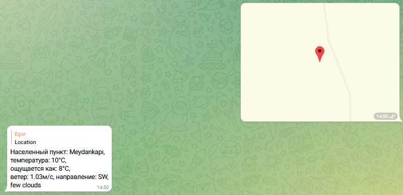
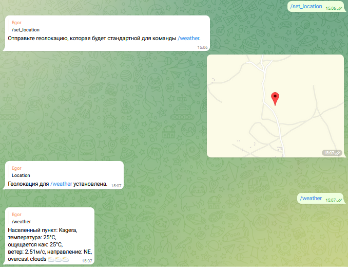

# TGWeatherBot

Простой бот для получения прогноза погоды через телеграм.

## Примеры работы
Получение прогноза при отправке геолокации:

    

Получение прогноза при заданной геолокации:

    

## Команды
/start, /help - стандартные команды;

'Вложения -> Геопозиция -> Отправить свою геопозицию' - возвращает погоду для отправленного местоположения;

/set_location - просит отправить местоположение и устанавливает его как стандартное;

/weather - возвращает погоду для стандартного местоположения, поставленного через /set_location. В целом проще и удобнее,
чем каждый раз отправлять местоположение заново, поэтому при ежедневном использовании предполагается использовать её.

## Установка
